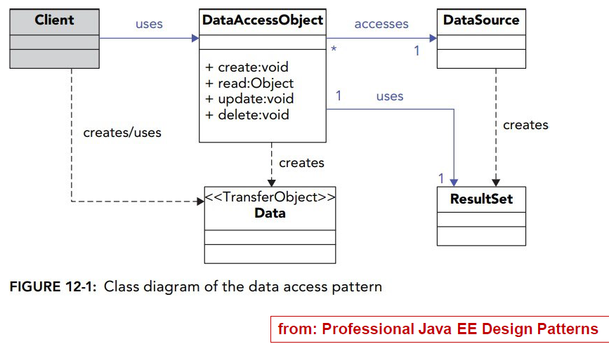

# DAO pattern

## Data Access Object (DAO）

Data Access Object sparetes business/domain from data layer: abstract & encapsulates data source & access

* CRUD functions: create, Retrieve, Update and Delete

motiveation of DAO is to isolate business/domain from difference amoung persistence implementations. For example:

* different SQL RDBMS implementations
* SQL vs non-SQL persistence
* RDMBS vs directories (such as LDAP, ActiveDirectory)

Factory pattern Commonly added (a DAO factory)

## DAO - typical components

Data Source&#x20;

* persistence implemention such as Object DBMDS, RDBMS, LDAP, XML, flat file.
* inclucde main method

Domain or Business Object, Client, Context

* requires access to Data Dources to obtain/store data
* implements all the abstract methods in the interface

Data Access Object (DAO)

* CRUD operations for Domain Object
* abstracts access to Data Source which implementation can change w/o impact on Domain layer
* Interface

Data Transfer Object (DTO) or Value Object

* encapsulates data sent between DAO and Domain layer and foole Java Bean conventions&#x20;
* get/set method

<figure><figcaption>
Week 4 PPT - P6
</figcaption></figure>

More Detail and code example：[https://blog.csdn.net/weixin\_43621681/article/details/89307290](https://blog.csdn.net/weixin\_43621681/article/details/89307290)

## DAO - optional components

DAO interface

* often used with  mult. entites in Data Source
  * same interface to acess all entities
  * a concrete DAO class created for each entity
  * naming conventaion: entity\_nameDAO
* DAO exceptions
  * Domain Object should not get "raw" exceptions from DATA Source (e.g. SQLException)
  * DAO should handle exception related to Data Source and throw custom exceptions to Damain Object tha are netural/independent of Data source
  * more detail: [https://blog.csdn.net/qq\_40178464/article/details/81639456](https://blog.csdn.net/qq\_40178464/article/details/81639456)

